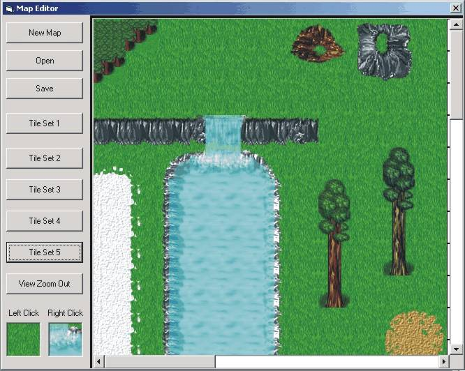



## Map Maker Deluxe

### Description

This is a tile map maker that I made for my RPG. You can open and save maps. You can also zoom out and view the whole map. The zip file also includes hundreds of tiles to use in a game. But the file is still under 0.6 MB
 
### More Info
 

             |
---                |---
**Submitted On**   |2001-12-23 10:41:44
**By**             |[Zach Hunt](https://github.com/Planet-Source-Code/PSCIndex/blob/master/ByAuthor/zach-hunt.md)
**Level**          |Intermediate
**User Rating**    |4.4 (22 globes from 5 users)
**Compatibility**  |VB 6\.0
**Category**       |[Games](https://github.com/Planet-Source-Code/PSCIndex/blob/master/ByCategory/games__1-38.md)
**World**          |[Visual Basic](https://github.com/Planet-Source-Code/PSCIndex/blob/master/ByWorld/visual-basic.md)
**Archive File**   |[Map\_Maker\_4538612312001\.zip](https://github.com/Planet-Source-Code/zach-hunt-map-maker-deluxe__1-30251/archive/master.zip)

